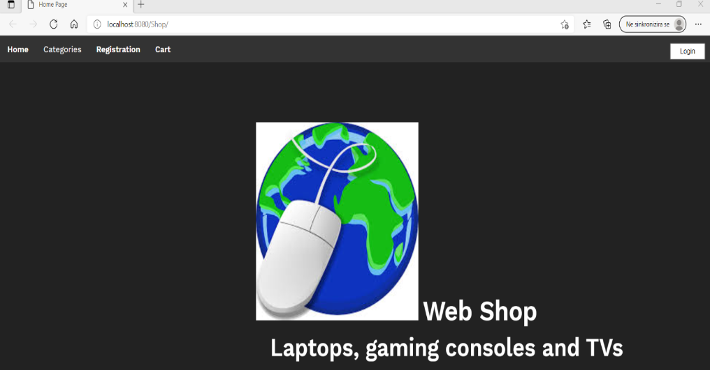
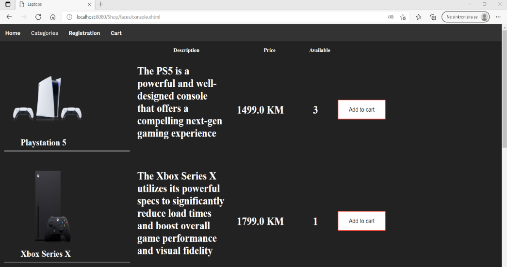
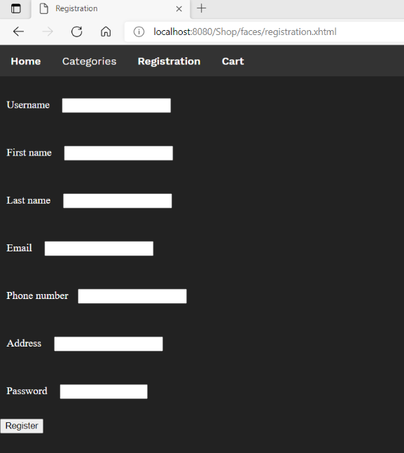
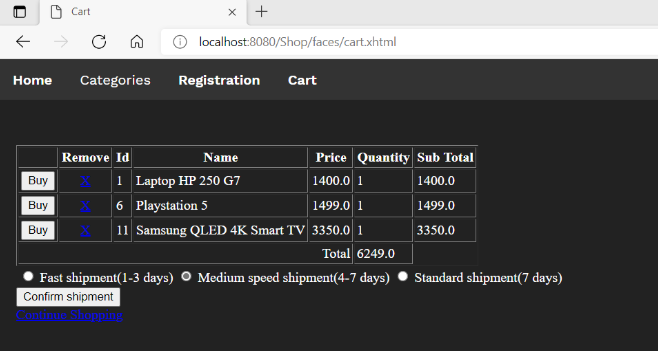

DOKUMENTACIJA I UPUTSTVA ZA ZAVRŠNI RAD  

WEB APLIKACIJA- PRODAVNICA GAMING OPREME

Tema završnog rada: web aplikacija- prodavnica gaming opreme( laptop, playstation, xbox, tv). Temu sam odabrao iz razloga što su danas ove aplikacije popularne i olakšavaju ljubiteljima igara i opreme povoljniju kupovinu. 

 

Kupnja preko interneta postaje jako popularna, a to štedi vrijeme, jer nema hodanja i razgledanja po trgovinama. Iz udobnosti svoga doma u samo nekoliko klikova obavimo kupnju. Dovoljno je da izaberemo proizvod, ubacimo u korpu i za nekoliko dana proizvod je na našim vratima. Ponuda je ogromna, možemo uporediti cijene proizvoda i izbjeći gužve po trgovinama.

Online kupovina postaje dominantna pogotovo unazad godinu dana pojavom pandemije Covid-19. Sve više ljudi se odlučuje na online kupovinu da bi zaštiti svoje zdravlje, ali time štede vrijeme i novac. 

Tehnologije koje su korištene pri izradi web aplikacije su: 

Java SDK 11: logika aplikacije, 

Java EE 8: kod koji se izvršava na serveru, 

HTML: definicija izgleda, 

CSS: definiše se izgled elemenata web stranice, 

Glassfish server: pokretanje aplikacije, 

JSF: omogućava dodavanje UI komponenti, 

Primefaces: dodatni set UI komponenti, 

MySQL: baza podataka, 

JBcrypt: šifriranje lozinke, 

Maven: za upravljanje projektom, 

Klasa, 

Objekat, 

Interface, 

JPA: namijenjen za upravljanje podacima.

Uputstvo za korištenje 

Korisnici 

Aplikacija je jednostavna za korištenje i korisnici bi trebali pomoću web pretraživača pristupiti web aplikaciji. 

Korisnik tada pristupa početnoj stranici koja nudi sljedeće opcije: 

-preglednik proizvoda, 

-registracija, 

-kategorija odabira i kupovine. 

Slika 1. Početna stranica 

Kada korisnik ode u pregled proizvoda može pogledati proizvode koji su na stanju, njihove cijene, slike i kratki opis. Proizvodi koje ova aplikacija nudi su: razne vrste laptopa, konzola i televizija.  Uz svaki proizvod stoji opcija dodavanja u korpu čime korisnik označava proizvod koji želi kupiti. 

Slika 2. Proizvodi 

Da bi izvršio pregled i kupovinu korisnik se mora registrovati i upisati sljedeće podatke: 

-korisničko ime, 

-ime, 

-prezime, 

-e- mail, 

-broj telefona, 

-adresa, 

-lozinka. 

Slika 3. Registracija 

Klikom na register korisnički podaci su sačuvani i odlaze u bazu registrovanih. Ako korisnik želi da provjeri koje je proizvode odabrao za kupovinu treba da se prijavi i unese korisničko ime i lozinku. Odabrane proizvode korisnik pronalazi u tabeli gdje su prikazani: naziv  proizvoda, jedinična cijena, količina i ukupna cijena.  

Slika 4. Korpa 

Ako korisnik ipak ne želi da izvrši kupovinu može ukloniti proizvode iz korpe. Ako se odluči za kupovinu, onda može birati da plati i odluči za koliko dana želi da mu se dostavi proizvod. Ukoliko na računu nema dovoljno novčanih sredstava dolazi obavijest da je došlo do greške i korisnik neće moći kupiti proizvode. Kada uspješno završi kupovinu korisnik se opet može prijaviti i kupovati, jer su njegovi podaci sačuvani u bazi. 

Uputstvo za rad na aplikaciji  

Developeri 

Pri izradi projekta korišten je Java SDK 11, Java EE 8, HTML, CSS, JSF i JPA tehnologije. Projekat je urađen u Netbeans 12.0 razvojnom okruženju uz korištenje Maven alata. Maven alat je korišten da bi se olakšalo developerima pri izradi web aplikacije, da se drajveri ne moraju ručno instalirati.  

Obrnuti inženjering je proces koji je korišten pri radu na projektu.  

Prvo je kreirana baza podataka u MySQL Workbenchu. Naziv baze je “project_db” i baza se sastoji od šest tabela. Sve tabele osim order_info imaju svoj primarni, order_info ima kompozitni ključ( order_id i product_id). Tabela orders je povezana sa tabelama user i payment pomoću stanog ključa, a tabela order_info je povezana sa tabelom shippers. 

Nakon kreiranja baze kreirane su klase entiteta, svaka tabela iz baze ima svoju klasu. Tabela order_info ima dvije klase OrderInfo i OrderInfoPK, kompozitni ključ ima posebnu klasu. Sve klase entiteta su smještene u app.entity paket.  

U entity paketu se nalazi facade paket u kojem se nalaze klase pomoću kojih se upravljaju i skladište/ uklanjaju podaci iz baze. U apstaktnoj klasi AbstractFacade se nalaze sve metode pomoću kojih se manipuliše podacima.  

Klase User i Product iz paketa entity će u facade paketu imati svoju klasu ( UserFacade i ProductFacade) i svoj interfejs ( UserFacadeLocal i ProductFacadeLocal). UserFacade i ProductFacade će naslijediti AbstractFacade i dobiti će sve metode iz te apstraktne klase.  

U interfejsu su deklarisane metode koje će implementirati i inicijalizovati klasa. ProductManagedBean i UserManagedBean služe za dobavljanje liste( korisnika i proizvoda) iz baze, dodavanje i uklanjanje korisnika i proizvoda. Korisnik da bi izvršio kupovinu mora se registrovati i prijaviti.  

Za registraciju se koristi RegisterManagedBean koji je povezan sa klasom RegisterBean i vrši dodavanje novih korisnika u bazu.  

Prije dodavanja korisnika u bazu vrši se šifrovanje lozinke pomoću Bcrypt biblioteke. Kada se korisnik prijavljuje potrebno je da unese korisničko ime i lozinku. Verifikacija lozinke se vrši pomoću Bcrypt- a. Kada se izvrši verifikacija u sesiju se skladište korisnički id i boolean loggedIn varijabla pomoću koje se provjerava da li je korisnik prijavljen.  

Odjava korisnika se obavlja pomoću LogoutManagedBean- a tako što se uklanja varijabla loggedIn iz sesije i poništava se sesija. Na front-endu je korišten JSF i Primefaces.  

Sve web stranice su XHTML dokumenti i nalaze se u Web Pages folderu. CSS fajlovi i slike koje su potrebne XHTML stranicama nalaze se u resources folderu. U XHTML stranicama se nalazi HTML i JSF kod i na klik dugmeta se pozivaju funkcije unutar određenog managed beana. 

Nakon što se izvrši insert u tabelu orders pomoću upita se dobije order_id, iz sesije se dobije user_id, pomoću kojeg se izvrši upit iz kojeg se dobije vrijednost amount varijable. Tabela order_info ima kompozitni ključ, pa je potrebno kreirati OrderInfoPK objekat kojem je potrebno postaviti vrijednosti order_id i product_id varijabli. Objektu orderInfo se postave sve potrebne vrijednosti i izvrši se persist da se objekat sačuva u bazu. Amount varijabla se promijeni tako što se od amount oduzme cijena proizvoda. 

Radio: Kavara Emil
