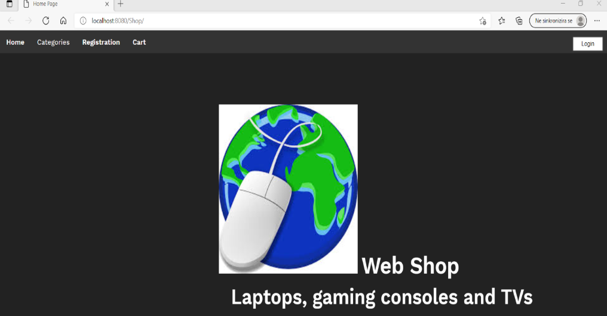
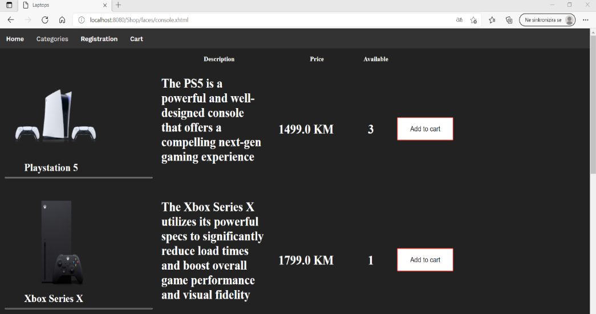
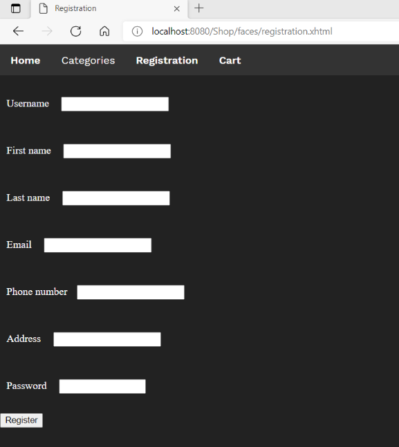

# Shop

This is a simple e-commerce application developed with [Java](https://www.java.com) using [NetBeans](https://netbeans.apache.org).

## Features

- Browse and search for products
- Add products to the shopping cart
- View and update the shopping cart
- Place an order
- Manage user profile

## Screenshots

Here are some screenshots of application

## Prerequisites

To run this application, you need to have [Java](https://www.java.com) and [NetBeans](https://netbeans.apache.org) installed on your system.

## Installation

1. Clone the repository:git clone https://github.com/EmilKavara/Shop.git

2. Open the project in NetBeans.

3. Build and run the application.

## Contributing

Contributions are welcome! If you find any issues or have suggestions, please open an issue or submit a pull request.

## Technologies Used

The technologies used in the development of the web application include:

Java SDK 11: Application logic
Java EE 8: Server-side code execution
HTML: Definition of the webpage structure
CSS: Styling of webpage elements
GlassFish Server: Application deployment and hosting
JSF (JavaServer Faces): UI component framework
PrimeFaces: Additional set of UI components
MySQL: Relational database management system
BCrypt: Password hashing
Maven: Project management tool
JPA (Java Persistence API): Data management and persistence
These technologies were used in combination to create a robust and feature-rich web application.

## Dependencies

The Shop application relies on the following libraries and frameworks:

- **Eclipse Persistence** (Version 2.5.2): Eclipse Persistence, also known as EclipseLink, is an advanced Object-Relational Mapping (ORM) framework used for database access and management. You can find more information about Eclipse Persistence [here](https://www.eclipse.org/eclipselink/).

- **Spring Boot** (Version 2.6.0): Spring Boot is a popular Java framework that simplifies the development of stand-alone, production-grade Spring-based applications. It provides an opinionated approach to configure and deploy Spring applications with minimal boilerplate code. Learn more about Spring Boot [here](https://spring.io/projects/spring-boot).

- **Bootstrap** (Version 5.1.3): Bootstrap is a widely-used open-source CSS framework that provides a collection of pre-built components and styles for creating responsive web applications. It offers a sleek and modern design that can be easily customized. Explore Bootstrap [here](https://getbootstrap.com/).

- **Thymeleaf** (Version 3.1.14): Thymeleaf is a modern server-side Java template engine for web and standalone environments. It enables developers to build dynamic web pages by providing a natural templating language that can be easily integrated with Spring applications. Find more details about Thymeleaf [here](https://www.thymeleaf.org/).

- **Jakarta** (Version 2.2.3): Jakarta EE, formerly known as Java EE, is a set of specifications and APIs for building enterprise Java applications. Jakarta EE provides a platform for developing scalable, secure, and portable applications. More information about Jakarta EE can be found [here](https://jakarta.ee/).

Please ensure to update the versions according to your specific requirements.

